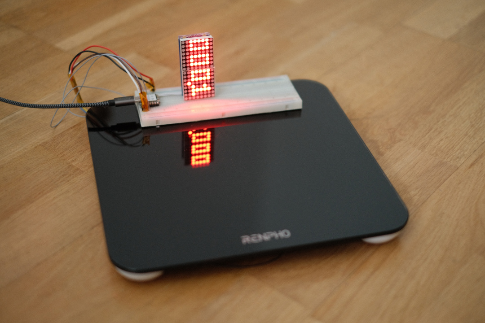

# ⚖️ SmartScale

SmartScale is a smart IoT weight scale project based on ESP32 and Flask, designed to collect and store weight in Garmin account.



---

## 🔧 Setup Instructions (Raspberry Pi or Linux)

1. **Clone the repository**

   ```bash
   git clone git@github.com:JonathanFricke/SmartScale.git
   cd SmartScale/backend
   ```

2. **Create a virtual environment**
   ```bash
   python3 -m venv .venv
   source .venv/bin/activate
   ```

3. **Upgrade pip (optional but recommended)**
	```bash
	pip install --upgrade pip
	```

4. **Install libraries**
	```bash
	pip install -r requirements.txt
	```


5. **Configure information**

	Create `.env` in `SmartScale/backend/`, based on `.env_template`.

	Fill in your SSID, Wi-Fi password, and custom API-key.

	Fill in server IP-address in `cert.conf`.

6. **Create SSL certificats**

	Run the following command to generate a self-signed certificate and private key based on `cert.conf`.

	```bash
	openssl req -x509 -newkey rsa:2048 -keyout certs/key.pem -out certs/cert.pem -days 3650 -nodes -config cert.conf -extensions v3_req
	```

	>⚠️ We need `cert.pem` content later for ESP32

<!-- 7. **Make server scripts executable**

	Enable execution for server scripts for user.
	```bash
	chmod u+x start_server.sh kill_server.sh restart_server.sh
	``` -->

7. **Enable server startup on boot**

	Edit crontab file.
	```bash
	crontab -e
	```
	Add the following line at the end, replacing `PATH_TO_REPO` with the full path to your cloned repository:
	```bash
	@reboot PATH_TO_REPO/backend/start_garmin_server.sh >> PATH_TO_REPO/backend/cron_log.txt 2>&1 &
	```

## 📟 Setup Instructions (ESP32)
This is a firmware project for [PlatformIO](https://platformio.org/), designed for embedded development on microcontrollers such as ESP32, Arduino, STM32, etc.

1. **Clone the repository**

   ```bash
   git clone git@github.com:JonathanFricke/SmartScale.git
   cd SmartScale/firmware
   ```

2. **Configure**

	Create `secret.h` in `SmartScale/firmware/`, based on `secret_template.h`.

	Fill in your Garmin account credentials and the same API key used in the backend `.env` file.

	Copy content of the server `certs/cert.pem` with linebreaks `\n` into `ROOT_CA`

	Example:
	```bash
	constexpr const char *ROOT_CA =
	"-----BEGIN CERTIFICATE-----\n"
	"MIIFBTCCAu2gAwIBAgIQS6hSk/eaL6JzBkuoBI110DANBgkqhkiG9w0BAQsFADBP\n"
		...
	"KPpdzvvtTnOPlC7SQZSYmdunr3Bf9b77AiC/ZidstK36dRILKz7OA54=\n"
	"-----END CERTIFICATE-----";
	```

	> ⚠️ If the certificate doesn't work, set `SSL_INSECURE=true`. This disables certificate verification and is a **security risk** — use only at your own risk!


3. **Set up PlatformIO**

	https://wiki.seeedstudio.com/xiao_esp32c6_with_platform_io/

	Don't create new Project but open ```SmartScale/firmware```

4. **Upload to ESP32**

	Connect ESP32 via USB.

	In PlatformIO, click the Upload button or run:

	```bash
	pio run --target upload
	```

## 🚀 Running the System
1. **ESP32 will run automatically when powered on.**

2. **Server managed with bash scripts**

	```bash
	cd SmartScale/backend
	```
	Manage server:
	```bash
	./start_server.sh     # Start server
	./restart_server.sh   # Restart server
	./kill_server.sh      # Stop server
	```

3. **Check server status**

	Open ```https://IP-ADDRESS:PORT``` in browser.

	You should see a status page confirming the server is available.

	⚠️ If using a self-signed certificate, your browser may show a warning. You can proceed anyway.


## 🔒 Tips: ##
 Never commit `.env` or `secret.h` files to Git. They contain sensitive credentials.

 Use `tail -f nohup.out` to view server logs in real time.

 Use the serial monitor (baud rate `9600`) to debug ESP32 output.


<!-- 3. **(Alternative) Install Miniconda**
   Download and install from:
   https://www.anaconda.com/docs/getting-started/miniconda/install

2. **Create and activate a new Conda environment**

   ```bash
   conda create -n smartscale python=3 pip
   conda activate smartscale -->


<!-- Use [pre-commit](https://pre-commit.com) for automated checks.

```bash
pip install pre-commit
pip install detect-secrets
pip install --upgrade identify
```
```bash
detect-secrets scan > .secrets.baseline
```
```bash
pre-commit install
```

Test with:

```bash
pre-commit run --all-files
```

If ```detect screts``` fails, change .secrets.baseline format to ```UTF-8```. -->
